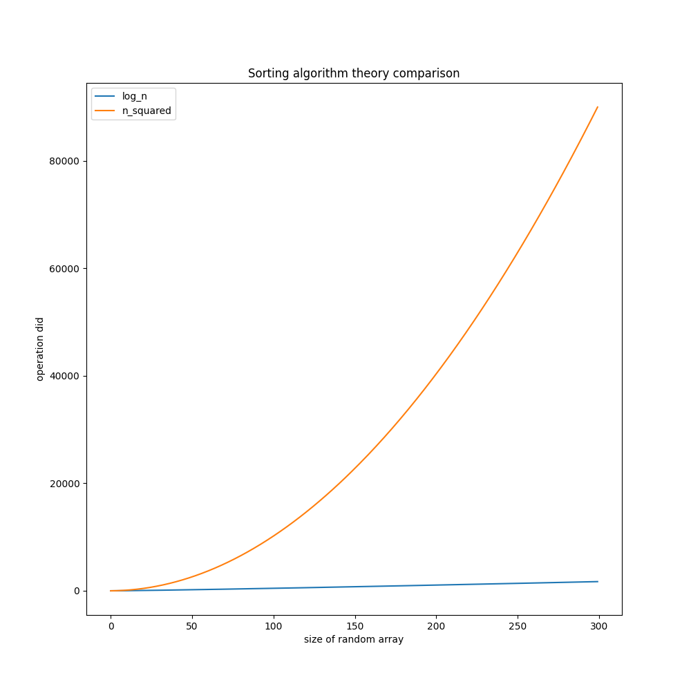
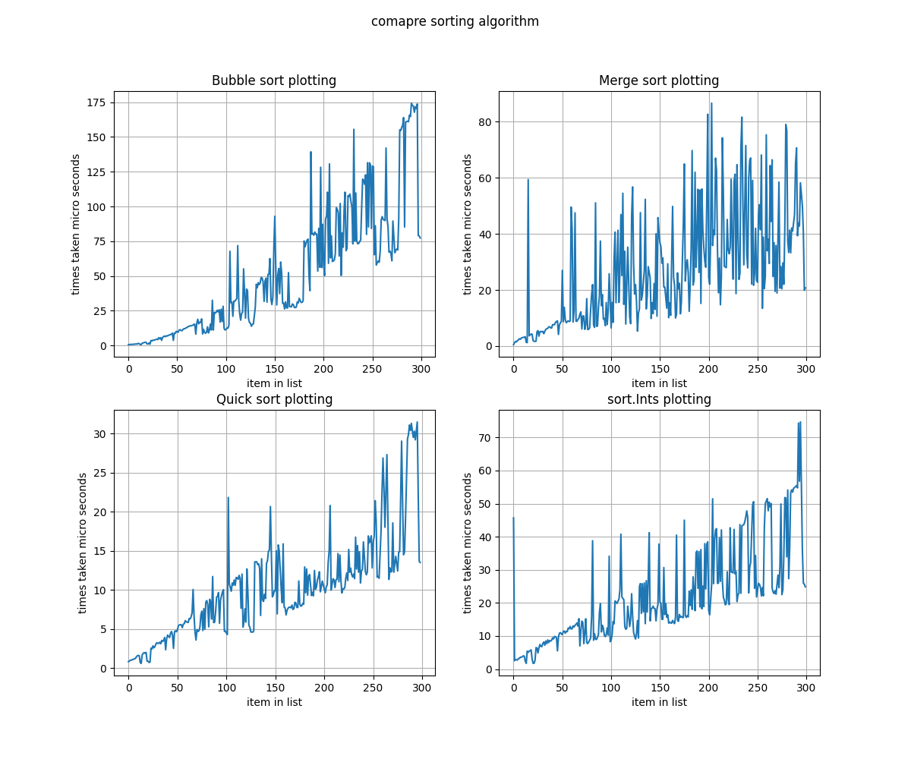
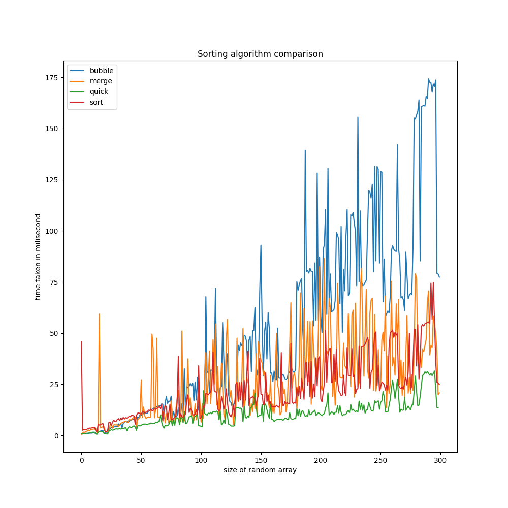
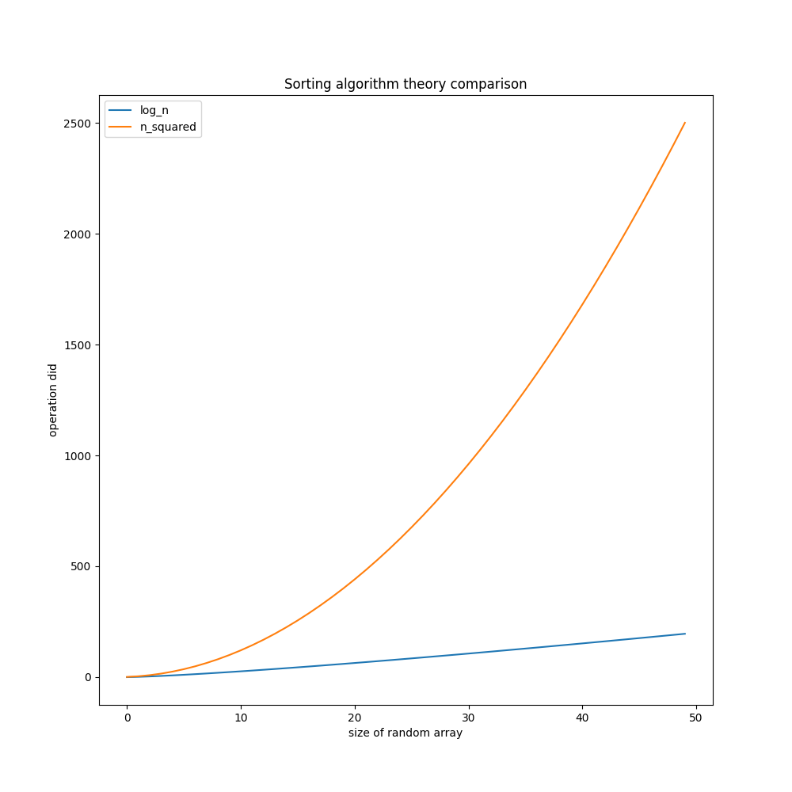
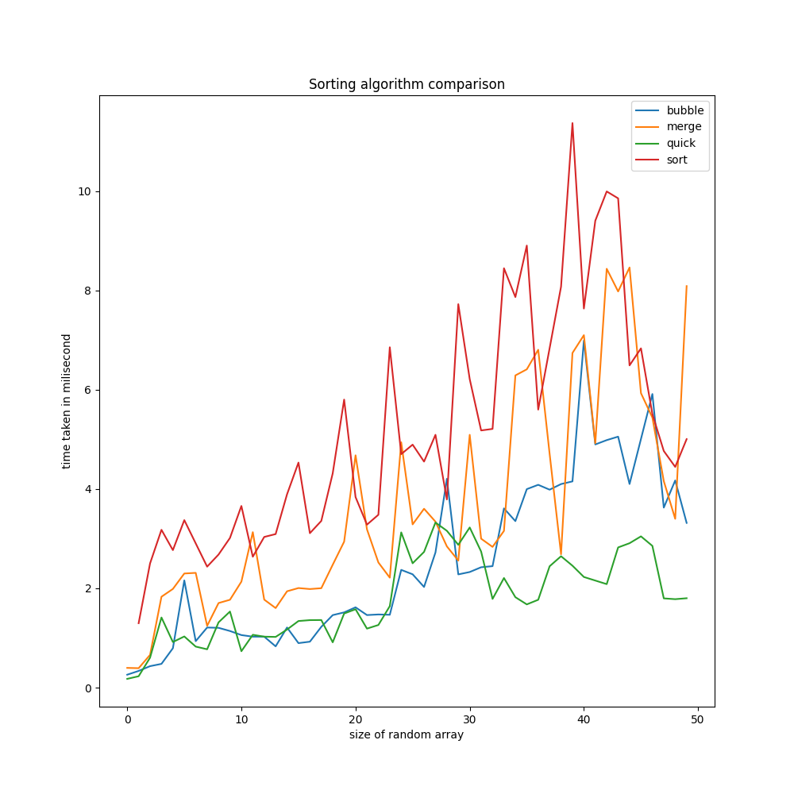
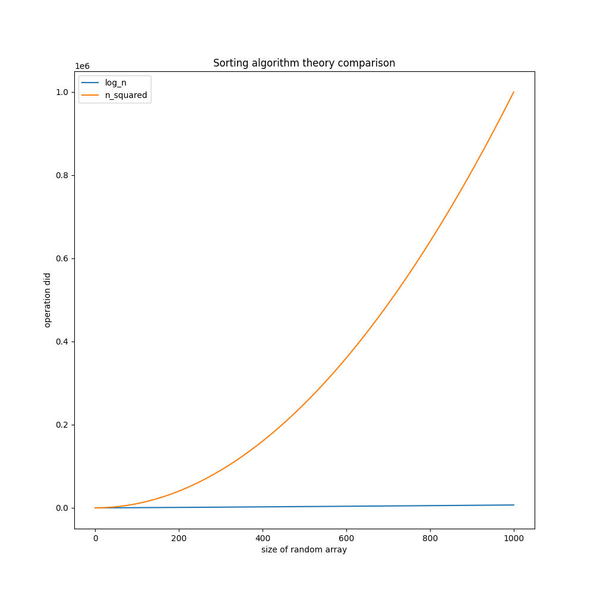
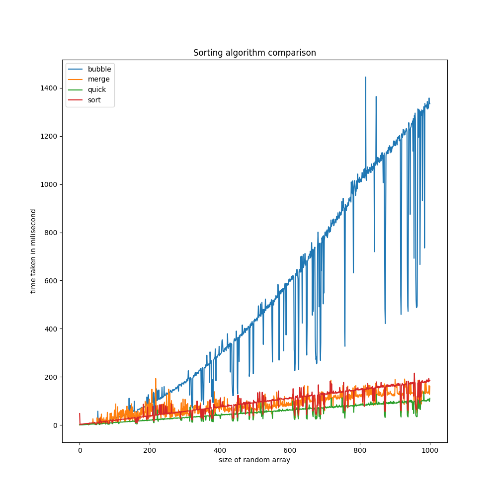
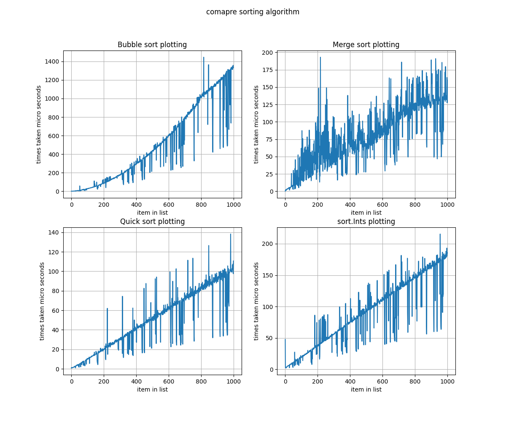

# Comparison Between Sorting Algorithm (with Go)

By theory `bubble sort` would had the `n^2` complexity, and the rest `(merge,quick,built-in sort func)` would had `n*log(n)` complexity. here is the graph example :

but when I implemented all of the sorting algorithm in golang, here is the graph for **300** array length test:

Let see closely on the first **50** random array sorting benchmark. We could see up to ~25 array size, bubble sort perform better than `merge` and `built-in` sort. However, based on the theory it aren't suppose to be. Here os the graph comparison

Wierd isn't it ? but when we see the bigger picture the theory would align with the implementation. Let see the on **1000** array size

## Running Workflow

- `./run-all.sh [n]`, change `[n]` with the number of max array size for benchmark

## Running Python Visualization

- `pip install -r requirements.txt`
- `python main.py`

## Running Golang Sorting

- run the `main` executable
- `go run main.go`

## Code Taken From

- https://blog.boot.dev/golang/quick-sort-golang/ (quick sort)
- https://www.tutorialspoint.com/how-to-generate-a-array-of-unique-random-numbers-in-golang (generate random number array)
