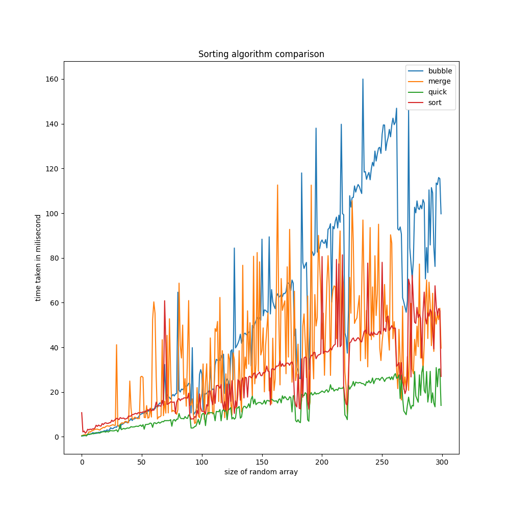

# Comparison Between Sorting Algorithm (with Go)

By theory `bubble sort` would had the `n^2` complexity, and the rest `(merge,quick,built-in sort func)` would had `n*log(n)` complexity. here is the graph example :

but when I implemented all of the sorting algorithm in golang here is the graph i got

## Running Python Visualization

- `pip install -r requirements.txt`
- `python main.py`

## Running Golang Sorting

- run the `main` executable
- `go run main.go`

## References

- https://blog.boot.dev/golang/quick-sort-golang/
